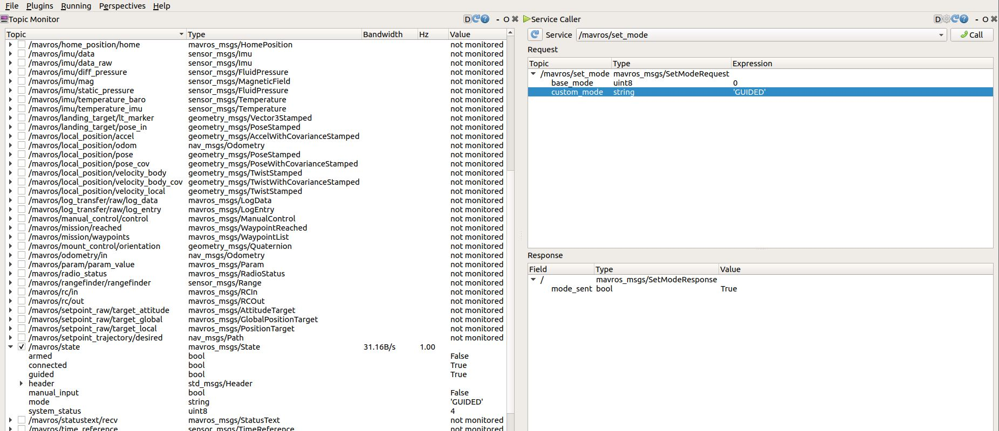

# How to change mode of Ardupilot-SITL Rover in MAVROS 

*Author:* Masoud Iranmehr

*Github Page:* [github.com/masoudir/Ardupilot_MAVROS_Examples](https://github.com/masoudir/Ardupilot_MAVROS_Examples)

# Initialize

Please follow steps mentioned in this [link](../index.md)

# Change vehicle mode

## Change vehicle mode using MAVProxy or Ardupilot-SITL

### Get mode

If you want to see the last mode of vehicle, you can just looking for the name before ">" character in these terminals.

### Set mode

Also if you want to change the mode, you can send your commands directly from your terminal provided by MAVProxy or SITL. For example if you want to change vehicle mode to *"GUIDED"*, you can type this command:

* `GUIDED` - Change mode to GUIDED

Also you can view all of available modes for your vehicle via this command:

* `mode` - Shows all available modes

## Change vehicle mode using ROS rqt:

At first you need to Add two plugin from rqt:

    Plugins -> Topics -> Topic Monitor
    Plugins -> Services -> Service Caller
    
Then in "Topic Monitor" side, you have to tick the topic of "/mavros/state" to view its contents, so that you can get 
the vehicle mode and also some other parameters such as "arm status" and "Guided status".

Then in "Service Caller" side, you have to select "/mavros/set_mode" and then in the field of "custom_mode", you can set
your vehicle mode. Then click on "call" button to send this message. The result should be as follow:

## Change vehicle mode using ROS command lines

### Get mode

If you want to see the last mode of the vehicle, you can just type this command:

* `rostopic echo /mavros/state` - Returns all contents of /mavros/state topic periodically

The results should be as similar as this:

    ---                                                                                                                                                                    
    header:                                                                                                                                                                
      stamp: 09                                                                                                                                                            
        secs: 1595198641                                                                                                                                                   
                                                                                                                                                                           
        nsecs: 651358095                                                                                                                                                   
      frame_id: ''                                                                                                                                                         
    connected: True                                                                                                                                                        
    guided: False                                                                                                                                                          
    manual_input: True                                                                                                                                                     
                                                                                                                                                                           
    mode: "MANUAL"                                                                                                                                                         
    system_status: 4                                                                                                                                                       
    --- 
    
You can find the mode in the field of "mode" of the result shown.

### Set mode

You need to call a ros service in order to do that. Just follow these commands:

* `rosservice info /mavros/set_mode` - To see its arguments and type of its Class Message

This command gives you this result:

    Node: /mavros
    URI: rosrpc://ubuntu:42571
    Type: mavros_msgs/SetMode
    Args: base_mode custom_mode

"mavros_msgs/SetMode" is the type of this service srv file and "Args" are our input arguments, but we have to know their types, so that we type this command:

* `rossrv show mavros_msgs/SetMode` - Getting details of the mentioned srv file

This will result as below:

    uint8 MAV_MODE_PREFLIGHT=0
    uint8 MAV_MODE_STABILIZE_DISARMED=80
    uint8 MAV_MODE_STABILIZE_ARMED=208
    uint8 MAV_MODE_MANUAL_DISARMED=64
    uint8 MAV_MODE_MANUAL_ARMED=192
    uint8 MAV_MODE_GUIDED_DISARMED=88
    uint8 MAV_MODE_GUIDED_ARMED=216
    uint8 MAV_MODE_AUTO_DISARMED=92
    uint8 MAV_MODE_AUTO_ARMED=220
    uint8 MAV_MODE_TEST_DISARMED=66
    uint8 MAV_MODE_TEST_ARMED=194
    uint8 base_mode
    string custom_mode
    ---
    bool mode_sent

In this case, "custom_mode" is the parameter needs to being configured and its type is "string". For example if you want to change the vehicle 
mode to "GUIDED" follow this command:

* `rosservice call /mavros/set_mode "custom_mode: 'GUIDED'"` - Change vehicle mode to "GUIDED"

Another method is to use "rosrun" command:

* `rosrun mavros mavsys mode -c MANUAL` - If you want to change mode to "MANUAL"

* `rosrun mavros mavsys mode -b <ENUM VALUE>` - If you want to use "base_mode" to change mode

